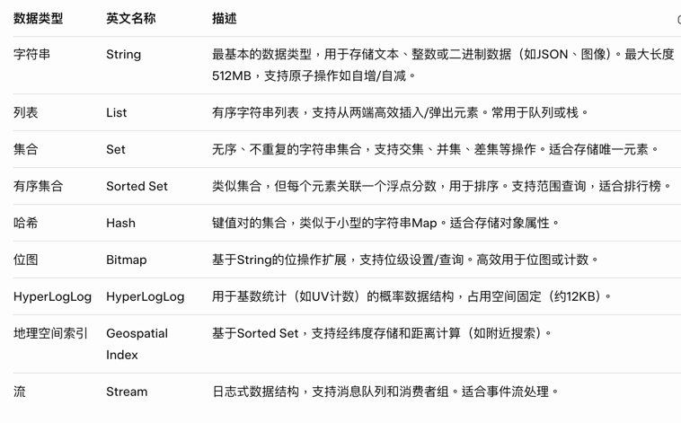

### redis 有哪些数据类型

### redis 哨兵如何交换
* Redis Sentinel 是 Redis 的高可用性解决方案，用于监控主从节点，并在主节点故障时自动进行故障转移（failover）。Sentinel 集群中的多个 Sentinel 实例通过选举机制来决定哪个实例成为“领导者”（leader），领导者负责执行实际的故障转移操作，包括选择从节点提升为主节点、重新配置其他从节点等。这个选举过程旨在避免“脑裂”（split-brain）问题，确保只有一个领导者进行操作。
  选举过程基于 Raft 算法的简化版本，使用投票和超时机制。以下是详细步骤（基于 Redis 官方文档和 Sentinel 规范）：
* 故障检测阶段
* 主观下线（SDOWN）：单个 Sentinel 实例检测到主节点不可达（例如，ping 超时超过 down-after-milliseconds 配置），标记为主观下线。这只是本地判断。
* 客观下线（ODOWN）：当至少 quorum（法定人数，通常为 Sentinel 总数的一半以上）个 Sentinel 实例同意主节点下线时，升级为客观下线。这触发选举过程。
* 选举启动 
* 一旦 ODOWN 确认，所有 Sentinel 进入故障转移准备状态。 
* 每个 Sentinel 都会尝试“自荐”为领导者：它会增加一个新的“纪元”（epoch，一个递增的版本号），并通过 SENTINEL is-master-down-by-addr 命令向其他 Sentinel 发送投票请求。
* 选举超时时间为 SENTINEL_ELECTION_TIMEOUT（默认 10 秒）和 failover-timeout 的最小值。如果选举超时未决出领导者，整个故障转移会中止。
* 投票与票数统计
* 投票规则： 每个 Sentinel 只投一票，且只投给纪元号更高的候选者（防止旧纪元干扰）。
* 候选者必须是“观察者”（observer）：即它也检测到 ODOWN，但不一定是发起者。
* 投票通过 Sentinel 间的 gossip 协议（hello 消息）传播，每 10Hz（每 0.1 秒）刷新状态。
* 获胜条件：候选者获得多数票（majority，通常为 Sentinel 总数 / 2 + 1）后，成为领导者。
* 示例：3 个 Sentinel，需要至少 2 票。
* 如果无人获得多数票，选举重试，直到超时。
* 状态转换：
* 获胜的 Sentinel 进入 SENTINEL_FAILOVER_STATE_WAIT_START 状态，确认票数。
* 如果确认成功，切换到 SENTINEL_FAILOVER_STATE_SELECT_SLAVE，开始选择从节点。
* 领导者执行故障转移
* 一旦选举出领导者，其他 Sentinel 成为观察者，监控过程但不干预。
* 领导者步骤：
* 选择从节点：根据从节点优先级（slave-priority 配置，越低优先级越高）、复制偏移量（最接近主节点数据）和运行 ID 等，选择最佳从节点。
* 提升从节点：发送 SLAVEOF NO ONE 命令，将其提升为主节点。
* 重新配置其他从节点：向剩余从节点发送 SLAVEOF <new-master-ip> <new-master-port>，让它们复制新主节点。
* 更新配置：通过 hello 消息广播新主节点信息，包括新纪元号。客户端查询 Sentinel 时，会获取更新后的主节点地址。
* 通知：可选发送通知给管理员（通过 sentinel notify 配置）。
* 整个过程通常在几秒内完成，超时后重试或中止。
* 特殊情况处理
* 网络分区（Net Split）：选举使用随机延迟启动故障转移，并通过持续监控避免多个领导者同时操作。纪元号确保只有最新配置生效。
* 脑裂预防：Quorum 和多数票机制确保只有多数 Sentinel 同意时才行动。如果分区导致少数 Sentinel 孤立，它们无法获得足够票数。
* 选举失败：如日志中常见 "+vote-for-leader failed"，可能是网络延迟或配置不一致。建议至少 3 个 Sentinel 分布在不同主机。
* 模拟测试：使用 SENTINEL SIMULATE-FAILURE 命令测试选举场景（如 crash-after-election）。
* 配置建议
* 最小部署：3 个 Sentinel，quorum=2，确保多数票可用。
* 日志监控：观察日志中的 "+new-epoch"、"+vote-for-leader"、"+odown" 和 "+elected-leader" 关键字。
* 客户端集成：客户端库（如 Jedis、Lettuce）应连接 Sentinel 查询主节点地址，实现自动重连。
* 这个过程确保了高可用性，但不处理数据丢失（异步复制可能导致）。如果需要更高级功能，考虑 Redis Cluster。如果您有具体配置或日志问题，可以提供更多细节！
