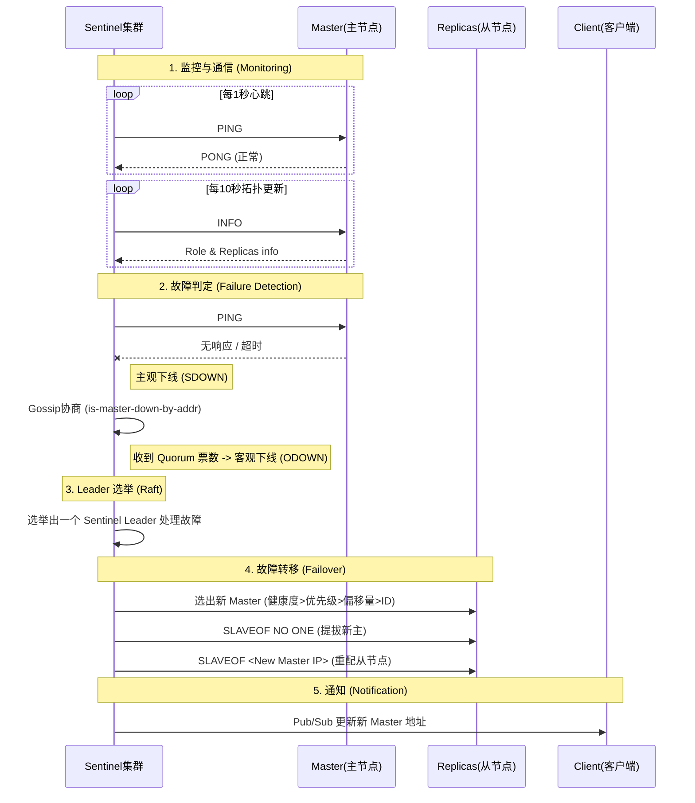

### redis 有哪些数据类型

### Redis 哨兵（Sentinel）是如何进行通信与故障转移的？

* **通信机制（Gossip & Pub/Sub）**：
    * **命令交互**：Sentinel 每秒向 Master/Slave 发送 `PING` 心跳；每 10 秒发送 `INFO` 获取拓扑信息。
    * **Pub/Sub（发布订阅）**：Sentinel 通过 Master 的 `__sentinel__:hello` 频道发布自己的信息（IP、端口、ID）和主节点配置。其他 Sentinel 订阅该频道，从而自动发现彼此并更新配置（无需手动配置其他 Sentinel 地址）。
* **主观下线 (SDOWN)**：
    * 单个 Sentinel 在 `down-after-milliseconds` 时间内未收到有效回复（PING），判定该节点为主观下线。
* **客观下线 (ODOWN) 与协商**：
    * 当 Sentinel 判定 Master SDOWN 后，通过 `SENTINEL is-master-down-by-addr` 命令询问其他 Sentinel。
    * 如果收到超过 `quorum`（法定人数）个 Sentinel 也判定该 Master 下线，则升级为客观下线 (ODOWN)。
* **Leader 选举 (Raft 算法)**：
    * 进入 ODOWN 后，Sentinel 节点会竞争成为 Leader（处理故障转移）。
    * 采用 Raft 算法：先到先得，获得半数以上（Majority）票数的 Sentinel 成为 Leader。
* **故障转移 (Failover)**：
    * **选新主**：Leader 按照“健康度 > 优先级 > 复制偏移量 > RunID”的规则从 Slaves 中选出新 Master。
    * **提拔**：发送 `SLAVEOF NO ONE` 让其独立。
    * **广播**：通知其他 Slaves 复制新 Master，并通过 Pub/Sub 通知客户端更新地址。

### Redis 为什么快？
* 单线程事件循环（核心命令执行单线程）避免了多线程上下文切换与锁竞争。
* 基于内存读写，延迟低。
* I/O 多路复用（epoll/kqueue）支撑高并发连接。
* 数据结构设计高效（跳表、哈希表、压缩列表等）。

### Redis 单线程为什么还能支撑高并发？
* 单线程指的是命令执行单线程，网络 I/O 通过多路复用处理。
* 大多数命令是 O(1) 或 O(logN) 且在内存中完成。
* 真正会拖慢的是慢命令/大 Key/阻塞命令（如大范围扫描、超大集合操作）。

### Redis 有哪些持久化方式？
* RDB：定时/触发生成快照文件。
* AOF：追加写命令日志（可配置刷盘策略）。
* 混合持久化（RDB + AOF）：重启时先加载 RDB，再回放增量 AOF（Redis 4+）。

### RDB 的优缺点
* 优点：文件紧凑、恢复速度快、适合备份与灾备。
* 缺点：可能丢失最后一次快照后的数据；生成快照时有额外 CPU/IO 开销（fork + 写盘）。

### AOF 的优缺点（appendonly）
* 优点：数据更安全（取决于 fsync 策略），可读性更强（记录操作）。
* 缺点：文件通常比 RDB 大；重放恢复速度可能更慢；需要 AOF rewrite 控制体积。

### AOF 三种刷盘策略有什么区别？
* always：每条命令都 fsync，最安全但性能最差。
* everysec：每秒 fsync，一般默认推荐，性能与安全折中（最多丢 1s）。
* no：由 OS 决定刷盘，性能最好但风险最高。

### Redis 过期删除策略有哪些？
* 定时删除：到期立刻删除（成本高，Redis 不采用纯定时）。
* 惰性删除：访问 key 时发现过期再删（可能造成内存浪费）。
* 定期删除：后台定期抽样检查并删除过期 key（Redis 采用惰性 + 定期组合）。

### Redis 内存淘汰策略（maxmemory-policy）有哪些？
* noeviction：不淘汰，写入直接报错。
* allkeys-lru / volatile-lru：对所有 key 或仅设置过期的 key，按 LRU 近似淘汰。
* allkeys-lfu / volatile-lfu：按 LFU 近似淘汰。
* allkeys-random / volatile-random：随机淘汰。
* volatile-ttl：优先淘汰 TTL 更小的 key。

### 什么是缓存穿透/击穿/雪崩？如何解决？
* 缓存穿透：查询不存在的数据，缓存不命中，每次都打到 DB。
* 解决：布隆过滤器、缓存空值（短 TTL）、参数校验。
* 缓存击穿：某个热点 key 过期瞬间，高并发打到 DB。
* 解决：互斥锁/单飞（singleflight）、热点 key 永不过期 + 异步刷新、逻辑过期。
* 缓存雪崩：大量 key 同时过期或 Redis 故障，流量打到 DB。
* 解决：过期时间加随机、分批预热、限流熔断、主从/集群高可用。

### 缓存与数据库一致性怎么做？
* 常用：先写 DB 再删缓存（cache-aside），删除失败可重试或异步补偿。
* 延迟双删：写 DB -> 删缓存 -> 延迟一段时间再删一次，降低并发下脏数据概率。
* 对强一致要求高：引入消息队列/订阅 binlog 做异步失效，或用分布式事务（通常不建议过重）。

### Redis 事务（MULTI/EXEC）是否保证原子性？
* EXEC 阶段按顺序执行命令，整体具有“批量执行”的原子性。
* 不支持回滚：执行时某条命令报错，其他命令仍可能执行。
* WATCH 可实现 CAS：监视 key 变化，变化则事务放弃。

### Lua 脚本为什么常用于分布式场景？
* Lua 脚本在 Redis 内部单线程执行，脚本内多条命令天然原子。
* 常用于：分布式锁解锁校验、限流、扣减库存等。
* 注意：脚本要避免长时间运行，否则会阻塞 Redis。

### 怎么实现分布式锁？有哪些坑？
* 基本做法：SET lock_key value NX EX seconds。
* 解锁必须校验 value，避免误删别人锁（Lua 脚本实现 get+del 原子）。
* 续期：看门狗/定时续约（避免业务超时导致锁提前过期）。
* 风险：时钟漂移、网络分区、主从复制延迟会影响锁的正确性；强一致锁要更复杂方案。

### Redis 主从复制原理是什么？
* 从库发起 PSYNC，与主库建立复制。
* 首次全量同步：主库生成 RDB 发送给从库，期间写命令进入 replication buffer。
* 后续增量同步：用 replication offset 进行增量复制。
* 复制默认异步，可能出现主从延迟与数据丢失窗口。

### Sentinel 和 Cluster 的区别
* Sentinel：主从架构的高可用方案，提供故障转移与客户端发现主节点；不做数据分片。
* Cluster：提供数据分片（16384 hash slots）+ 高可用；客户端需要支持 cluster 协议重定向。

### Redis Cluster 为什么是 16384 个槽？
* 槽数量用于平衡路由表大小与迁移成本。
* 槽越多路由表越大；槽太少迁移不够细粒度。
* 16384（2^14）在工程上折中，并且位运算/编码方便。

### Redis Cluster 的重定向 MOVED 和 ASK 有什么区别？
* MOVED：槽已稳定迁移到新节点，客户端应更新本地路由缓存。
* ASK：槽正在迁移过程中，临时去目标节点执行一次（需先 ASKING）。

### 为什么 Redis Cluster 不支持多 key 跨槽事务？
* 跨槽意味着需要跨节点协调与分布式事务，会大幅增加复杂度与性能成本。
* 解决：让相关 key 落到同一槽（hash tag：{user:1}:a、{user:1}:b）。

### 大 Key 有什么危害？怎么治理？
* 危害：单条命令执行时间长导致阻塞、网络传输大、持久化/复制变慢。
* 排查：redis-cli --bigkeys（有开销）、业务侧统计、慢日志。
* 治理：拆分 key（分片存储）、压缩/精简 value、改用更合适的数据结构、异步删除。

### Redis 慢日志（slowlog）有什么用？
* 记录执行耗时超过阈值的命令，定位慢命令/大 key。
* 常用命令：SLOWLOG GET / LEN / RESET。

### keys 和 scan 的区别
* KEYS：全量遍历，O(N)，会阻塞，线上慎用。
* SCAN：增量迭代，单次开销小，不保证一次返回所有，适合线上巡检。

### Redis 删除 key 会阻塞吗？如何优化删除大 key？
* DEL 删除大 key 可能阻塞。
* 可用 UNLINK（异步删除，后台线程回收内存）。
* 也可以按成员分批删除（如大集合逐步删除）。

### Redis 常见数据结构底层实现（面试高频）
* String：SDS（简单动态字符串）。
* Hash：小对象压缩（listpack/ziplist，版本相关），大对象用哈希表。
* List：quicklist（链表 + listpack）。
* Set：intset 或哈希表。
* ZSet：跳表（skiplist）+ 字典（dict）。
