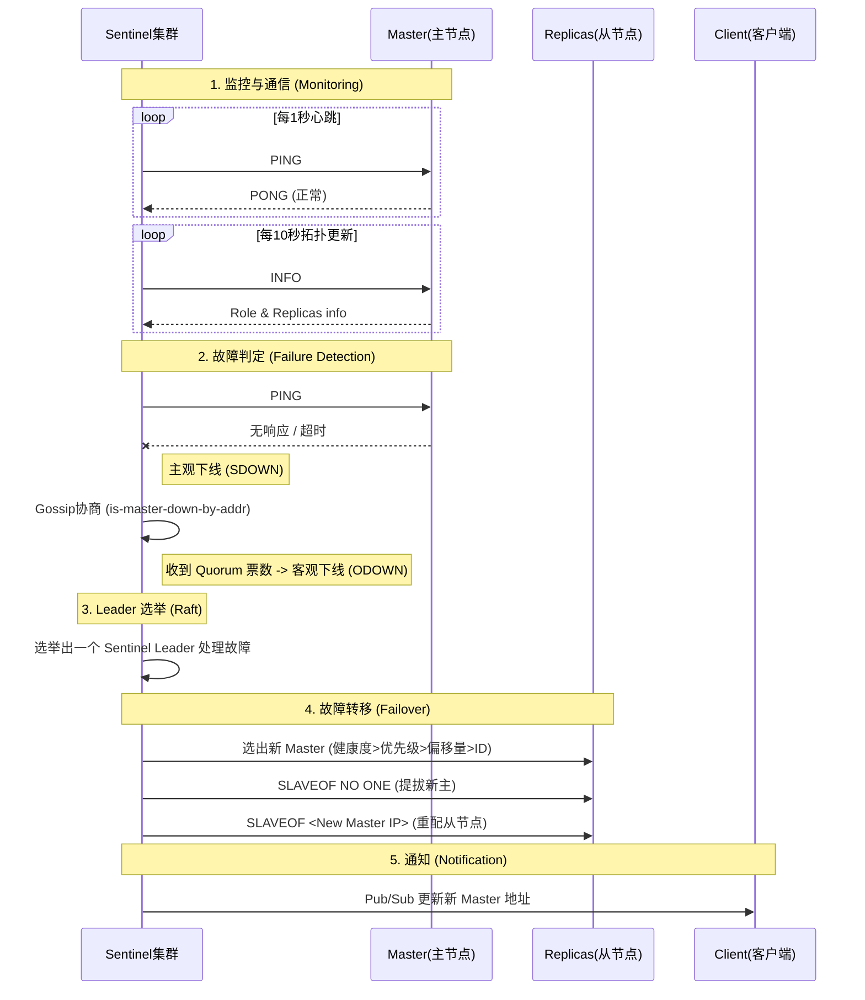

### redis 有哪些数据类型

### Redis 哨兵（Sentinel）是如何进行通信与故障转移的？

* **通信机制（Gossip & Pub/Sub）**：
    * **命令交互**：Sentinel 每秒向 Master/Slave 发送 `PING` 心跳；每 10 秒发送 `INFO` 获取拓扑信息。
    * **Pub/Sub（发布订阅）**：Sentinel 通过 Master 的 `__sentinel__:hello` 频道发布自己的信息（IP、端口、ID）和主节点配置。其他 Sentinel 订阅该频道，从而自动发现彼此并更新配置（无需手动配置其他 Sentinel 地址）。
* **主观下线 (SDOWN)**：
    * 单个 Sentinel 在 `down-after-milliseconds` 时间内未收到有效回复（PING），判定该节点为主观下线。
* **客观下线 (ODOWN) 与协商**：
    * 当 Sentinel 判定 Master SDOWN 后，通过 `SENTINEL is-master-down-by-addr` 命令询问其他 Sentinel。
    * 如果收到超过 `quorum`（法定人数）个 Sentinel 也判定该 Master 下线，则升级为客观下线 (ODOWN)。
* **Leader 选举 (Raft 算法)**：
    * 进入 ODOWN 后，Sentinel 节点会竞争成为 Leader（处理故障转移）。
    * 采用 Raft 算法：先到先得，获得半数以上（Majority）票数的 Sentinel 成为 Leader。
* **故障转移 (Failover)**：
    * **选新主**：Leader 按照“健康度 > 优先级 > 复制偏移量 > RunID”的规则从 Slaves 中选出新 Master。
    * **提拔**：发送 `SLAVEOF NO ONE` 让其独立。
    * **广播**：通知其他 Slaves 复制新 Master，并通过 Pub/Sub 通知客户端更新地址。

### Redis 为什么快？
* 单线程事件循环（核心命令执行单线程）避免了多线程上下文切换与锁竞争。
* 基于内存读写，延迟低。
* I/O 多路复用（epoll/kqueue）支撑高并发连接。
* 数据结构设计高效（跳表、哈希表、压缩列表等）。

### Redis 单线程为什么还能支撑高并发？
* 单线程指的是命令执行单线程，网络 I/O 通过多路复用处理。
* 大多数命令是 O(1) 或 O(logN) 且在内存中完成。
* 真正会拖慢的是慢命令/大 Key/阻塞命令（如大范围扫描、超大集合操作）。

### Redis 有哪些持久化方式？
* RDB：定时/触发生成快照文件。
* AOF：追加写命令日志（可配置刷盘策略）。
* 混合持久化（RDB + AOF）：重启时先加载 RDB，再回放增量 AOF（Redis 4+）。

### RDB 的优缺点
* 优点：文件紧凑、恢复速度快、适合备份与灾备。
* 缺点：可能丢失最后一次快照后的数据；生成快照时有额外 CPU/IO 开销（fork + 写盘）。

### AOF 的优缺点（appendonly）
* 优点：数据更安全（取决于 fsync 策略），可读性更强（记录操作）。
* 缺点：文件通常比 RDB 大；重放恢复速度可能更慢；需要 AOF rewrite 控制体积。

### AOF 三种刷盘策略有什么区别？
* always：每条命令都 fsync，最安全但性能最差。
* everysec：每秒 fsync，一般默认推荐，性能与安全折中（最多丢 1s）。
* no：由 OS 决定刷盘，性能最好但风险最高。

### Redis 过期删除策略有哪些？
* 定时删除：到期立刻删除（成本高，Redis 不采用纯定时）。
* 惰性删除：访问 key 时发现过期再删（可能造成内存浪费）。
* 定期删除：后台定期抽样检查并删除过期 key（Redis 采用惰性 + 定期组合）。

### Redis 内存淘汰策略（maxmemory-policy）有哪些？
* noeviction：不淘汰，写入直接报错。
* allkeys-lru / volatile-lru：对所有 key 或仅设置过期的 key，按 LRU 近似淘汰。
* allkeys-lfu / volatile-lfu：按 LFU 近似淘汰。
* allkeys-random / volatile-random：随机淘汰。
* volatile-ttl：优先淘汰 TTL 更小的 key。

### 什么是缓存穿透/击穿/雪崩？如何解决？
* 缓存穿透：查询不存在的数据，缓存不命中，每次都打到 DB。
* 解决：布隆过滤器、缓存空值（短 TTL）、参数校验。
* 缓存击穿：某个热点 key 过期瞬间，高并发打到 DB。
* 解决：互斥锁/单飞（singleflight）、热点 key 永不过期 + 异步刷新、逻辑过期。
* 缓存雪崩：大量 key 同时过期或 Redis 故障，流量打到 DB。
* 解决：过期时间加随机、分批预热、限流熔断、主从/集群高可用。

### 缓存与数据库一致性怎么做？
* 常用：先写 DB 再删缓存（cache-aside），删除失败可重试或异步补偿。
* 延迟双删：写 DB -> 删缓存 -> 延迟一段时间再删一次，降低并发下脏数据概率。
* 对强一致要求高：引入消息队列/订阅 binlog 做异步失效，或用分布式事务（通常不建议过重）。

### Redis 事务（MULTI/EXEC）是否保证原子性？
* EXEC 阶段按顺序执行命令，整体具有“批量执行”的原子性。
* 不支持回滚：执行时某条命令报错，其他命令仍可能执行。
* WATCH 可实现 CAS：监视 key 变化，变化则事务放弃。

### Lua 脚本为什么常用于分布式场景？
* Lua 脚本在 Redis 内部单线程执行，脚本内多条命令天然原子。
* 常用于：分布式锁解锁校验、限流、扣减库存等。
* 注意：脚本要避免长时间运行，否则会阻塞 Redis。

### 怎么实现分布式锁？有哪些坑？
* 基本做法：SET lock_key value NX EX seconds。
* 解锁必须校验 value，避免误删别人锁（Lua 脚本实现 get+del 原子）。
* 续期：看门狗/定时续约（避免业务超时导致锁提前过期）。
* 风险：时钟漂移、网络分区、主从复制延迟会影响锁的正确性；强一致锁要更复杂方案。

### Redis 主从复制原理是什么？
* 从库发起 PSYNC，与主库建立复制。
* 首次全量同步：主库生成 RDB 发送给从库，期间写命令进入 replication buffer。
* 后续增量同步：用 replication offset 进行增量复制。
* 复制默认异步，可能出现主从延迟与数据丢失窗口。

### Sentinel 和 Cluster 的区别
* Sentinel：主从架构的高可用方案，提供故障转移与客户端发现主节点；不做数据分片。
* Cluster：提供数据分片（16384 hash slots）+ 高可用；客户端需要支持 cluster 协议重定向。

### Redis Cluster 为什么是 16384 个槽？
* 槽数量用于平衡路由表大小与迁移成本。
* 槽越多路由表越大；槽太少迁移不够细粒度。
* 16384（2^14）在工程上折中，并且位运算/编码方便。

### Redis Cluster 的重定向 MOVED 和 ASK 有什么区别？
* MOVED：槽已稳定迁移到新节点，客户端应更新本地路由缓存。
* ASK：槽正在迁移过程中，临时去目标节点执行一次（需先 ASKING）。

### 为什么 Redis Cluster 不支持多 key 跨槽事务？
* 跨槽意味着需要跨节点协调与分布式事务，会大幅增加复杂度与性能成本。
* 解决：让相关 key 落到同一槽（hash tag：{user:1}:a、{user:1}:b）。

### 大 Key 有什么危害？怎么治理？
* 危害：单条命令执行时间长导致阻塞、网络传输大、持久化/复制变慢。
* 排查：redis-cli --bigkeys（有开销）、业务侧统计、慢日志。
* 治理：拆分 key（分片存储）、压缩/精简 value、改用更合适的数据结构、异步删除。

### Redis 慢日志（slowlog）有什么用？
* 记录执行耗时超过阈值的命令，定位慢命令/大 key。
* 常用命令：SLOWLOG GET / LEN / RESET。

### keys 和 scan 的区别
* KEYS：全量遍历，O(N)，会阻塞，线上慎用。
* SCAN：增量迭代，单次开销小，不保证一次返回所有，适合线上巡检。

### Redis 删除 key 会阻塞吗？如何优化删除大 key？
* DEL 删除大 key 可能阻塞。
* 可用 UNLINK（异步删除，后台线程回收内存）。
* 也可以按成员分批删除（如大集合逐步删除）。

### Redis 常见数据结构底层实现（面试高频）
* String：SDS（简单动态字符串）。
* Hash：小对象压缩（listpack/ziplist，版本相关），大对象用哈希表。
* List：quicklist（链表 + listpack）。
* Set：intset 或哈希表。
* ZSet：跳表（skiplist）+ 字典（dict）。

### Redis 进阶与内核面试题

#### 1. Redis 6.0 为什么要引入多线程？
* **背景**：Redis 的瓶颈通常在**网络 I/O**而非 CPU 计算。
* **实现**：核心命令执行依然是**单线程**（保证原子性，无需锁复杂性），但**网络数据的读写（Read/Write syscall）**和**协议解析**改为多线程并行处理。
* **效果**：显著提升吞吐量（QPS 翻倍）。
* **配置**：需手动开启 `io-threads`。

#### 2. 什么是渐进式 Rehash？
* **问题**：哈希表扩容时，如果一次性迁移所有数据，会导致主线程阻塞（Stop-the-world）。
* **方案**：将 Rehash 动作分摊到后续的每一次增删改查和定时任务中。
    * **操作触发**：每次对字典 CRUD 时，顺便迁移 1 个 bucket。
    * **定时触发**：后台定时任务也会尝试迁移一部分。
    * **读操作**：先查旧表，再查新表；**写操作**：直接写入新表。

#### 3. Redlock 算法的流程与争议是什么？
* **场景**：解决 Redis 集群（Master-Slave）下主从切换可能导致锁丢失的问题（因为复制是异步的）。
* **流程**：
    1. 获取当前时间 T1。
    2. 按顺序尝试从 N 个 Master 节点获取锁（超时时间要短）。
    3. 如果在 N/2+1 个节点获取成功，且耗时 < 锁有效期，则加锁成功。
* **争议**：Martin Kleppmann 指出依赖系统时钟可能导致安全性问题（NPC 问题：Network, Pause, Clock）。工程上通常认为单 Redis + 看门狗或 CP 模型的 ZooKeeper/Etcd 更稳健。

#### 4. 为什么要用跳表（SkipList）而不用红黑树？
* **实现简单**：跳表更容易实现，且支持无锁编程（CAS）。
* **范围查询**：跳表天然支持范围查询（类似 B+ 树叶子链表），红黑树要做范围查询需要复杂的中序遍历。
* **内存占用**：跳表平均指针数（1.33 个）少于红黑树（2 个）。

#### 5. HyperLogLog 是什么？适用场景？
* **原理**：概率数据结构，利用伯努利试验估算基数，占用极小内存（12KB 可存 2^64 个不同元素）。
* **场景**：UV 统计（允许 0.81% 误差），不适合要求 100% 精确的计数。

#### 6. 什么是 Double Write Buffer（双写缓冲）？（注：这是 MySQL 的，但在 Redis 持久化讨论中常被问及对比）
* Redis 没有双写缓冲，但在 AOF Rewrite 时利用了操作系统的 **COW (Copy On Write)** 机制来保证父子进程数据一致且节省内存。

#### 7. 缓存热点 Key 重建（击穿）的进阶解法？
* **互斥锁**：最简单，但可能阻塞吞吐。
* **逻辑过期（Logical Expiration）**：
    * Key 设置永不过期，Value 中包含过期时间戳。
    * 发现快过期时，直接返回旧值，同时异步启动线程去更新缓存。
    * 适合高可用要求高的场景（不回源阻塞）。

### Redis 面试题库大全 (补充精选)

#### 1. 基础与数据类型
1.  **Redis 支持哪几种数据类型？** String, Hash, List, Set, ZSet, Bitmap, HyperLogLog, GEO, Stream。
2.  **String 的最大容量是多少？** 512MB。
3.  **List 的底层实现？** 3.2前是 ziplist/linkedlist，3.2后是 quicklist（链表+ziplist）。
4.  **ZSet 的底层实现？** ziplist（元素少时）或 skiplist + dict（元素多时）。
5.  **Hash 的底层实现？** ziplist（元素少时）或 hashtable。
6.  **`SETNX` 的作用？** Set if Not Exists，常用于分布式锁。
7.  **`MGET` 和 `pipeline` 的区别？**
    *   `MGET`：原子操作，服务端处理。
    *   `Pipeline`：客户端打包命令，服务端非原子，减少 RTT。
8.  **Redis 为什么是单线程的？** 瓶颈在网络/内存不在 CPU；避免锁竞争；代码简单。
9.  **Redis 6.0 的多线程是什么？** 仅用于网络 I/O 读写解析，命令执行仍是单线程。
10. **`KEYS *` 的危害？** O(N) 扫描全表，阻塞主线程，导致卡顿。
11. **如何遍历所有 Key？** 使用 `SCAN` 游标迭代。
12. **Redis 字符串底层结构？** SDS (Simple Dynamic String)，二进制安全，预分配空间。
13. **Bitmap 的应用场景？** 签到、用户在线状态（位操作节省空间）。
14. **HyperLogLog 的应用场景？** 百万级 UV 统计（误差 0.81%）。
15. **GEO 的底层实现？** ZSet（GeoHash 将经纬度转为 Score）。
16. **Stream 是什么？** Redis 5.0 引入的消息队列数据结构，支持消费者组。
17. **`EXPIRE` 设置过期时间的原理？** 独立字典存储过期时间。
18. **`TTL` 返回什么？** 剩余秒数；-1 永不过期；-2 Key 不存在。
19. **SortSet 为什么用跳表不用红黑树？** 范围查找效率相当，实现更简单，内存占用更低。
20. **Redis 默认端口？** 6379。

#### 2. 持久化 (RDB & AOF)
21. **RDB 原理？** `fork` 子进程，Copy-On-Write 写入内存快照到磁盘。
22. **AOF 原理？** 记录所有写命令到日志文件。
23. **RDB 优缺点？** 恢复快，文件小；但会丢数据（最后一次快照后）。
24. **AOF 优缺点？** 数据全；但文件大，恢复慢。
25. **AOF 重写（Rewrite）？** 后台重写 AOF，去除冗余命令（如多次 `INCR` 合并为 `SET`），减小体积。
26. **混合持久化？** RDB 镜像 + AOF 增量日志，兼顾速度与安全。
27. **如果机器断电，AOF 怎么恢复？** `redis-check-aof --fix` 修复文件。
28. **`bgsave` 和 `save` 的区别？** `save` 阻塞主线程；`bgsave` 后台异步。
29. **写时复制（COW）是什么？** `fork` 子进程时共享父进程内存，只有写操作时才复制页，节省内存。
30. **RDB 过程中 Redis 能写吗？** 能，主进程处理写请求，COW 机制保证子进程看到的是快照。

#### 3. 过期与淘汰
31. **过期策略有哪些？** 惰性删除（访问时删）+ 定期删除（后台抽查）。
32. **内存淘汰策略（Eviction）？** 当内存满时触发。
33. **`allkeys-lru`？** 从所有 Key 中淘汰最近最少使用的。
34. **`volatile-lru`？** 从设置了过期时间的 Key 中淘汰 LRU。
35. **`allkeys-random`？** 随机淘汰。
36. **`noeviction`？** 报错（默认）。
37. **LRU 算法的缺点？** 需要维护链表；Redis 使用近似 LRU（随机采样）。
38. **LFU 算法（4.0+）？** Least Frequently Used，按访问频率淘汰。
39. **如何设置 Redis 最大内存？** `maxmemory`。
40. **MySQL 有 2000w 数据，Redis 只有 20w，如何保证热点数据？** 使用 `allkeys-lru` 策略。

#### 4. 集群与高可用
41. **主从复制的作用？** 读写分离，灾备。
42. **主从复制流程？** 全量（RDB）+ 增量（Replication Buffer）。
43. **哨兵（Sentinel）的作用？** 监控、故障转移、通知。
44. **哨兵如何判定主观下线？** `PING` 超时。
45. **哨兵如何判定客观下线？** 多个哨兵协商（Quorum）。
46. **Redis Cluster 方案？** 去中心化，16384 个槽，数据分片。
47. **Cluster 节点怎么通信？** Gossip 协议。
48. **CRC16 算法？** 计算 Key 属于哪个槽：`CRC16(key) % 16384`。
49. **Hash Tag 是什么？** `{user:100}.name`，只计算 `{}` 内字符的 Hash，强制不同 Key 落入同一槽。
50. **Codis 是什么？** 早期代理中间件模式的集群方案（豌豆荚开源）。
51. **脑裂问题？** 主从切换时，旧主未挂但网络分区，客户端仍写入旧主，导致数据丢失。
52. **如何解决脑裂？** `min-slaves-to-write`（最少从节点数）和 `min-slaves-max-lag`。
53. **Cluster 重定向（MOVED/ASK）？** 客户端请求的 Key 不在当前节点，节点返回跳转地址。
54. **主从同步风暴？** 多个从节点同时复制主节点，拖垮主节点网卡。解决：级联复制（主->从->从）。
55. **读写分离的坑？** 读到过期数据（主从延迟），读己之写（写完马上读不到）。

#### 5. 缓存场景与问题
56. **缓存穿透？** 查不存在的数据。解决：布隆过滤器、空对象缓存。
57. **缓存击穿？** 热点 Key 过期。解决：互斥锁、永不过期+异步刷新。
58. **缓存雪崩？** 大量 Key 同时过期。解决：随机 TTL、集群。
59. **热点 Key 问题（Hot Key）？** 导致单分片压力过大。解决：本地缓存、拆分 Key。
60. **Big Key 问题？** 阻塞传输和删除。解决：拆分、UNLINK 异步删。
61. **缓存预热？** 启动时加载热点数据。
62. **缓存降级？** Redis 挂了返回默认值。
63. **Cache Aside Pattern？** 读：读缓存->读库->写缓存；写：写库->删缓存。
64. **为什么是删缓存不是更新缓存？** 避免并发脏数据，且更新成本高（可能不被读）。
65. **延迟双删？** 写库->删缓存->Sleep->删缓存。解决主从延迟导致的脏缓存。
66. **Read-Through/Write-Through？** 缓存代理层负责读写 DB，应用只对缓存交互。
67. **Write-Behind（异步写）？** 先写缓存，异步批量写 DB（性能高，易丢数据）。

#### 6. 分布式锁
68. **Redis 实现分布式锁命令？** `SET key value NX PX 10000`。
69. **Redlock 算法？** 多个主节点请求锁，过半成功。
70. **锁误删问题？** 线程 A 删了 线程 B 的锁。解决：Value 存 UUID，删除前校验（Lua）。
71. **锁续期（Watchdog）？** 业务未执行完锁快过期，守护线程自动续期（Redisson 实现）。
72. **Redis 锁 vs Zookeeper 锁？** Redis AP 模型（高性能，可能丢锁）；ZK CP 模型（强一致，性能略低）。

#### 7. 性能与运维
73. **如何测试 Redis 性能？** `redis-benchmark`。
74. **影响 Redis 性能的因素？** 网络带宽、CPU 主频（非核数）、内存速度。
75. **慢查询日志？** `slowlog-log-slower-than`。
76. **Redis 占用内存过高怎么办？** 分析 BigKey，检查内存碎片 `info memory`。
77. **内存碎片率？** `mem_fragmentation_ratio` > 1.5 需处理（重启或自动清理）。
78. **Redis 报 `Could not get a resource from the pool`？** 连接池耗尽，检查 timeout 或连接数。
79. **Linux 内核参数优化？** `vm.overcommit_memory=1`（防止 fork 失败），禁用 THP（透明大页）。
80. **Redis 事务支持回滚吗？** 不支持。

#### 8. 语言与客户端
81. **Jedis 和 Lettuce (Java)？** Jedis 直连，Lettuce 基于 Netty 异步。
82. **Predis (PHP)？** 纯 PHP 实现的客户端。
83. **PhpRedis (PHP)？** C 扩展实现的客户端，性能更高。
84. **连接池的作用？** 复用 TCP 连接，减少握手开销。
85. **序列化方式？** JSON, Protobuf, MsgPack, PHP Serialize。JSON 可读性好，Protobuf 体积小。

#### 9. 进阶与实战
86. **Redis 如何实现延时队列？** ZSet（Score 存时间戳），轮询 ZRANGEBYSCORE。
87. **Redis 实现布隆过滤器？** Bitmap + 多个 Hash 函数（或使用 RedisBloom 模块）。
88. **Redis 发布订阅（Pub/Sub）？** 无法持久化消息，消费者下线丢消息。建议用 Stream。
89. **Lua 脚本的作用？** 原子执行多条命令，减少网络开销。
90. **Redis Module？** 扩展 Redis 功能（如 RediSearch, RedisJSON）。
91. **如何统计 3 天内的活跃用户？** Bitmap，每天一个，做 `BITOP OR`。
92. **Redis 到底是 AP 还是 CP？** AP（分区容忍 + 可用性），主从切换可能丢数据。
93. **什么是 `CLIENT PAUSE`？** 暂停处理客户端请求（故障演练）。
94. **Redis 协议（RESP）？** 简单文本协议（`+OK`, `$5\r\nhello`）。
95. **Hash 冲突怎么解决？** 链地址法（Chain），扩容时渐进式 Rehash。
96. **Rehash 过程？** 两个 Hash 表，数据分批搬迁，读操作查两表，写操作写新表。
97. **Redis 6.0 ACL？** 访问控制列表，限制用户可执行的命令和 Key。
98. **IO 多路复用模型？** epoll (Linux), kqueue (BSD), select (Windows)。
99. **Select, Poll, Epoll 区别？** Epoll 无连接数限制，事件驱动 O(1)，性能最高。
100. **Redis 作为消息队列的缺点？** 消息积压爆内存；ACK 机制不完善（Stream 改善了这点）。

