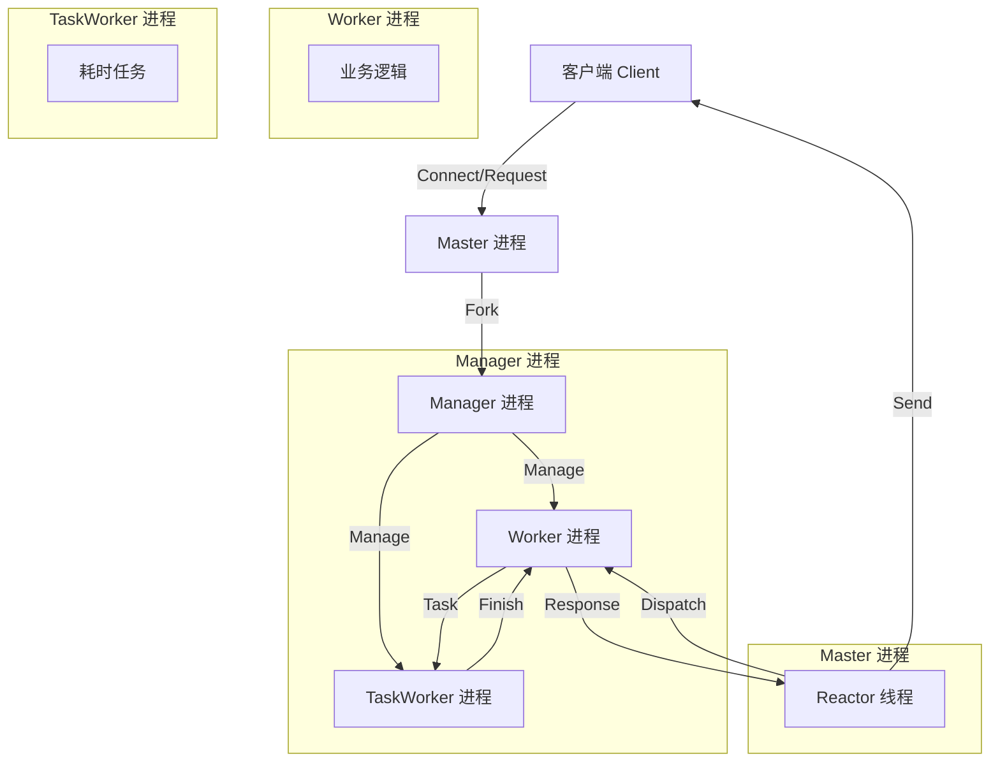
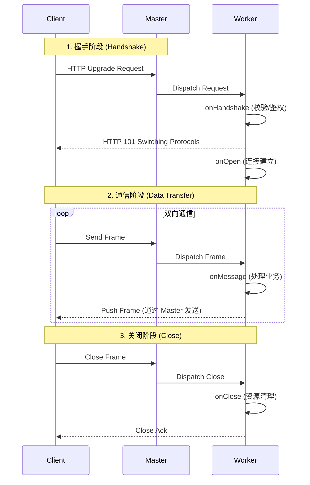

### swoole 协程与线程差异
* Swoole 协程与线程的交互
* Swoole 协程环境：Swoole 运行在单线程事件循环中，协程是用户态的“虚拟线程”，通过事件循环调度。PHP 的 Swoole 扩展通过 libeio 或 libuv 处理异步 I/O，协程在 I/O 等待
  
* 
* 
* 

### Swoole 的进程模型是什么？

* Master 进程：负责监听端口、管理 Worker/TaskWorker 生命周期。
* Manager 进程：负责管理 Worker/TaskWorker，异常退出时拉起新进程。
* Worker 进程：处理网络事件与业务逻辑（onReceive/onRequest 等）。
* TaskWorker 进程：异步任务处理（onTask/onFinish），避免阻塞 Worker。

### Worker 和 TaskWorker 的区别
* Worker：面向请求/连接，处理 IO 事件回调，尽量不做耗时操作。
* TaskWorker：专门跑耗时任务（发邮件、图片处理、调用第三方接口等）。
* 典型用法：Worker 收到请求后投递 task，快速返回；TaskWorker 异步完成。

### Swoole 协程是什么？适合哪些场景？
* 协程是用户态调度单位（比线程更轻量），遇到可挂起的 IO 会让出执行权。
* 适合：大量 IO 并发（HTTP/RPC/DB/Redis），减少线程/进程开销。
* 不适合：纯 CPU 密集计算（会占满事件循环，影响所有协程）。

### 协程和异步回调的区别
* 异步回调：需要写回调函数，流程割裂，易形成“回调地狱”。
* 协程：用同步写法写异步逻辑，可读性好；底层仍是事件驱动。

### Swoole 常见生命周期回调有哪些？
* onStart：Master 启动。
* onManagerStart：Manager 启动。
* onWorkerStart：Worker/TaskWorker 启动（适合做初始化）。
* onWorkerExit/onWorkerStop：进程退出/停止。
* TCP：onConnect/onReceive/onClose。
* HTTP：onRequest。
* Task：onTask/onFinish。

### 为什么 onWorkerStart 里要避免创建全局共享连接？
* 每个 Worker 是独立进程，进程间内存不共享。
* 连接（DB/Redis）应在每个 Worker 内各自创建并复用（连接池/长连接）。
* 如果在 Master 里创建连接，fork 后可能导致连接状态异常。

### Swoole 如何避免阻塞 Worker？
* 耗时逻辑放到 TaskWorker（task/finish）。
* 使用协程客户端（协程 MySQL/Redis/HTTP）让 IO 可挂起。
* 避免在 Worker 中执行：sleep、文件大 IO、CPU 密集计算、大循环。

### Swoole 定时器怎么用？有哪些注意点？
* 常见：swoole_timer_after / swoole_timer_tick。
* 注意：定时器回调运行在 Worker 内，同样不能做长时间阻塞。
* 需要考虑：重入（tick 未执行完又触发）、异常处理与取消定时器。

### Swoole 中如何实现进程间通信（IPC）？
* 进程间消息：sendMessage（Worker 间）、管道（Unix socket）、消息队列。
* 共享内存：Swoole\Table（适合小型共享状态，注意容量与并发写）。
* 通常更推荐：把共享状态放到 Redis/MySQL 等外部存储，减少进程间复杂度。

### Swoole\Table 适合做什么？
* 适合：计数器、在线人数、简单配置缓存、心跳/状态表。
* 不适合：存大对象/大文本、复杂结构（字段类型受限）。
* 注意：Table 是固定容量，创建时要估算行数与字段。

### Swoole 的热重载（reload）是怎么做的？
* reload 会平滑重启 Worker（Manager 逐个重启），连接尽量不受影响。
* 常用于：代码更新、配置更新。
* 注意：
* 必须确保业务状态可重建（避免依赖进程内状态）。
* onWorkerStart 做好初始化与资源重连。

### Swoole 内存泄漏如何排查？
* 常见原因：全局数组持续增长、缓存未清理、对象引用链、第三方扩展泄漏。
* 手段：
* 定期监控 Worker 内存（memory_get_usage）。
* 设置 max_request 自动重启 Worker，控制长期运行带来的碎片/泄漏。
* 结合 pmap/top、swoole 的 stats 信息定位。

### max_request 有什么用？为什么要设置？
* 每处理 N 个请求重启 Worker，降低内存碎片与潜在泄漏影响。
* 代价：重启期间会有轻微抖动；需要配合足够的 worker_num。

### worker_num 一般怎么设置？
* CPU 密集：接近 CPU 核数。
* IO 密集：可略高于 CPU 核数（但不要盲目开太多，避免上下文切换）。
* 需要结合：压测、CPU 使用率、RT、队列堆积情况。

### dispatch_mode 有哪些常见模式？
* 影响连接请求如何分配到 Worker。
* 常见目标：
* 尽量让同一连接固定到同一 Worker（便于连接上下文）。
* 或者更均匀分配，避免单 Worker 热点。
* 具体模式选择要结合协议（TCP/HTTP/WebSocket）与业务特性。

### Swoole WebSocket 执行流程

* **握手 (Handshake)**：客户端发起 HTTP 请求升级为 WebSocket。`onHandshake` 可自定义鉴权，默认自动通过。
* **连接建立 (onOpen)**：握手成功后触发，fd 产生，可用于绑定 uid。
* **消息交互 (onMessage)**：全双工通信，接收 Frame 数据（文本/二进制）。
* **连接关闭 (onClose)**：客户端或服务端主动关闭时触发，清理 fd 映射。

### WebSocket 场景常见面试点
* 如何保存 fd 与用户的映射：fd->uid/uid->fd（可用 Table/Redis）。
* 如何群发：遍历连接列表或维护房间/频道（注意性能与大连接数）。
* 断线重连：需要处理 fd 变化与旧连接清理。

### Swoole 常见坑有哪些？
* 在 Worker 中使用阻塞 IO 或长时间 CPU 计算导致整体卡顿。
* 把请求级变量存全局导致数据串扰（尤其在协程并发下）。
* 忽略异常处理导致协程泄漏/资源未释放。
* 在 onWorkerStart 初始化资源后，reload/重启时未正确重连。

### Swoole 进阶与内核面试题

#### 1. Swoole 协程调度器（Scheduler）是如何工作的？
* **核心原理**：基于栈（Stackful）的协程，每个协程有独立的 C 栈。
* **调度流程**：
    1. 协程遇到 IO 操作（如 MySQL 查询）时，Swoole 底层将该 socket 加入 epoll 事件监听。
    2. **Yield（让出）**：保存当前协程的上下文（寄存器、栈指针），切换回主协程（调度器）。
    3. 主协程继续处理其他事件或协程。
    4. **Resume（恢复）**：当 epoll 通知 socket 可读/写时，调度器找到对应的协程，恢复其上下文，从暂停处继续执行。

#### 2. Swoole 的 Hook 机制原理是什么？为什么要 Hook？
* **目的**：让用户使用原生 PHP 函数（如 `file_get_contents`, `pdo->query`, `curl`）也能享受到协程的异步非阻塞能力，无需修改旧代码。
* **原理**：
    * Swoole 在扩展启动时，使用 `dlopen/dlsym` 等机制覆盖（劫持）了 libc 的标准 socket 函数（如 `connect`, `read`, `write`）。
    * 当 PHP 调用这些函数时，实际执行的是 Swoole 的逻辑：如果是非阻塞操作直接执行；如果是阻塞操作，则触发协程切换（Yield），直到 IO 完成。

#### 3. 什么是 Reactor 模式？Swoole 中怎么体现？
* **定义**：一种事件驱动模式，有一个或多个并发输入源，服务程序有一个 Service Handler，它将输入请求解复用（Dispatch）给对应的 Request Handler。
* **Swoole 体现**：
    * **Reactor 线程**：负责维护 EventLoop，监听 `epoll` 事件（连接、读写）。
    * **分发**：当 socket 可读时，Reactor 负责读取数据，并根据 Dispatch Mode 将数据包发送给 Worker 进程进行业务处理。

#### 4. Swoole 连接池（Connection Pool）实现的关键点？
* **Channel（通道）**：利用 `Swoole\Coroutine\Channel` 作为队列存储连接对象。
* **入队/出队**：
    * `get()`：`pop()` 弹出一个空闲连接。如果 Channel 为空，协程挂起等待，直到有连接归还或超时。
    * `put()`：使用完后 `push()` 归还连接，唤醒等待的协程。
* **健康检查**：获取连接时需检查连接是否断开（ping），断开则重连。

#### 5. Swoole 的 TCP 粘包/拆包问题怎么解决？
* **原因**：TCP 是流式协议，没有边界。
* **Swoole 配置**：
    * **EOF 检测**：`open_eof_check => true`, `package_eof => "\r\n"`。
    * **长度检测（推荐）**：`open_length_check => true`，配合 `package_length_type`（如 'N' 4字节头）和 `package_body_offset`，Swoole 底层会自动截取完整的数据包再回调 `onReceive`。

#### 6. 协程中的 Context（上下文）如何管理？
* **问题**：协程切换时，全局变量（如 `$_GET`, `$_POST`）或单例可能被污染。
* **解决**：使用 `Swoole\Coroutine\Context` 或 `Context::set/get`（通常框架封装）。
* **原理**：将数据绑定到当前协程 ID（CID）上，随协程销毁而自动清理，实现协程隔离。

### Swoole 面试题库大全 (补充精选)

#### 1. 基础与架构
1.  **Swoole 的运行模式有哪些？** `SWOOLE_PROCESS` (多进程模式, 默认/推荐), `SWOOLE_BASE` (单线程模式, 适合轻量级).
2.  **Swoole 的 Master 进程包含哪些线程？** 主线程 (处理信号/定时器), Reactor 线程组 (维护 TCP 连接/网络 IO).
3.  **Reactor 线程和 Worker 进程如何通信？** 通过 Unix Socket 或 共享内存 (RingBuffer).
4.  **Worker 进程和 TaskWorker 进程的区别？**
    *   Worker: 处理请求，主要业务逻辑，支持协程。
    *   TaskWorker: 处理耗时任务 (同步阻塞)，不支持协程 (Swoole 4.x 后部分支持，但主要用于同步任务)。
5.  **Manager 进程的作用？** 负责 fork/回收 Worker 和 TaskWorker 进程，监控进程状态。
6.  **Swoole 如何实现异步非阻塞？** 基于 `epoll` (Linux) / `kqueue` (BSD) 事件循环。
7.  **Swoole 和 FPM 的主要区别？**
    *   FPM: 同步阻塞，每次请求创建/销毁进程 (或复用但清理状态)。
    *   Swoole: 常驻内存，异步/协程非阻塞，连接复用，变量需手动管理。
8.  **Swoole 支持 Windows 吗？** 不支持原生 Windows (需 Cygwin/WSL/Docker)。
9.  **什么是 Swoole Shell？** 指 `Co::run(function(){ ... })` 这种交互式环境或命令行工具。
10. **Swoole 的心跳检测机制？** `heartbeat_check_interval` 和 `heartbeat_idle_time`，服务端主动断开不活跃连接。

#### 2. 协程 (Coroutine)
11. **协程和线程的开销对比？** 线程栈 MB 级，协程栈 KB 级；线程切换内核态，协程切换用户态 (汇编指令)。
12. **什么是协程容器？** `Co\run()` 或 `Co\Scheduler`，协程必须在容器内运行。
13. **`go()` 函数的作用？** 创建一个新的协程 (别名 `Co::create`)。
14. **协程让出 (Yield) 的时机？** 遇到 IO 操作 (MySQL/Redis/Socket) 或显式 `Co::yield()`。
15. **协程恢复 (Resume) 的时机？** IO 完成触发 epoll 事件，或显式 `Co::resume()`。
16. **`defer` 在协程中的作用？** 协程退出前执行，用于资源清理 (类似 Go)。
17. **如何在协程中并发执行任务？** `WaitGroup` 或 `Channel`。
18. **什么是 `Swoole\Runtime::enableCoroutine()`？** 一键 Hook 原生 PHP 函数 (MySQLi, PDO, Stream, cURL) 为协程化。
19. **协程中可以使用 `sleep()` 吗？** 不可以，会阻塞整个进程。应使用 `Co::sleep()`。
20. **协程中可以使用 `exit()`/`die()` 吗？** 不可以，会抛出 `Swoole\ExitException`，导致 Worker 退出。

#### 3. 通信与同步 (Channel/Table/Atomic)
21. **Channel (通道) 的主要用途？** 协程间通讯 (CSP 模型)，生产者-消费者模式，并发控制。
22. **Channel 是跨进程的吗？** 不是，仅限同一进程下的协程间。跨进程需用 Unix Socket 或 Redis/消息队列。
23. **Table (内存表) 的特点？** 基于共享内存，跨进程，高性能，行锁 (自旋锁)，需预分配大小。
24. **Table 支持的数据类型？** Int, String, Float. 不支持 Array/Object (需序列化)。
25. **Atomic (原子计数器) 的作用？** 跨进程原子操作 (加减)，基于 CPU 原子指令 (CAS)，无锁。
26. **Lock (锁) 有哪些类型？** 文件锁, 互斥锁 (Mutex), 读写锁, 自旋锁。
27. **Swoole 如何实现广播？** 遍历 `$server->connections` 发送数据 (注意 `connections` 迭代器包含所有 fd)。
28. **如何获取当前协程 ID？** `Co::getCid()` 或 `Co::getuid()`。
29. **什么是 `Co\Context`？** 协程上下文，用于隔离协程间的全局变量。
30. **Swoole 的事件回调是同步还是异步？** 回调函数本身是在 Worker 进程中顺序执行的，但触发是基于事件的。

#### 4. 网络与协议
31. **如何处理 TCP 粘包？**
    *   `open_eof_check`: 按结束符。
    *   `open_length_check`: 按包头长度字段 (推荐)。
32. **WebSocket 握手流程在 Swoole 中如何处理？** 底层自动处理，触发 `onOpen`。也可自定义 `onHandshake`。
33. **Swoole 支持 HTTP2 吗？** 支持，配置 `open_http2_protocol => true`。
34. **如何实现 HTTPS？** 配置 `ssl_cert_file` 和 `ssl_key_file`。
35. **UDP 服务怎么创建？** `new Swoole\Server('0.0.0.0', 9502, SWOOLE_PROCESS, SWOOLE_SOCK_UDP)`。
36. **Task 任务投递的数据大小限制？** 取决于 `buffer_output_size`，默认 2M，过大建议走临时文件。
37. **`sendfile` 的作用？** 零拷贝发送文件，由操作系统内核完成。
38. **MQTT 协议支持？** 需自行解析或使用相关库，Swoole 层面作为 TCP 服务。
39. **Swoole 客户端 (Client) 有哪些？** `Coroutine\Client` (TCP/UDP), `Coroutine\Http\Client`.
40. **连接断开检测？** `onClose` 回调。

#### 5. 内存与资源管理
41. **常驻内存会导致什么问题？** 内存泄漏 (Memory Leak)。
42. **如何排查内存泄漏？**
    *   `Swoole\Tracker`。
    *   Linux 工具: `valgrind`, `smem`。
    *   PHP: `gc_collect_cycles()`, `memory_get_usage()` 打点监控。
43. **`max_request` 的作用？** Worker 处理 n 个请求后自动重启，防止内存泄漏。
44. **`max_conn` (最大连接数) 如何设置？** 根据机器文件句柄限制 (`ulimit -n`) 和内存大小设置。
45. **Swoole 的 Buffer 是什么？** 接收/发送缓冲区，防止网速慢导致阻塞。
46. **如何共享大对象？** Table (有限制), Serialize 存文件/Redis, 独立进程管理 (如 UserProcess)。
47. **Worker 进程隔离性？** 进程间内存不共享，静态变量在 fork 后互不影响。
48. **Master 进程挂了怎么办？** 整个服务停止。
49. **Manager 进程挂了怎么办？** Master 会重新拉起 Manager。
50. **Worker 进程挂了怎么办？** Manager 会重新拉起 Worker。

#### 6. 定时器 (Timer)
51. **`Timer::tick` 和 `Timer::after`？** 周期执行 / 一次性延时执行。
52. **定时器是基于什么的？** `epoll_wait` 的超时机制 或 `timerfd` (Linux)。
53. **定时器的精度？** 毫秒级。
54. **定时器 ID 唯一吗？** 进程内唯一。
55. **如何清除定时器？** `Timer::clear($id)`。
56. **在 WorkerStart 中使用定时器注意什么？** 此时协程环境已就绪 (Swoole 4+)。
57. **Master 进程可以使用定时器吗？** 可以，但只能在 `onStart` 中，且不能操作 Worker 资源。
58. **大量定时器会有性能问题吗？** 最小堆实现，插入删除 O(logN)，一般问题不大，但超大量建议用时间轮算法。
59. **定时器回调会创建协程吗？** 4.x 版本默认不会，需手动 `go`；部分配置下会自动。
60. **协程 `sleep` 和 Timer 的区别？** `sleep` 挂起当前协程；`Timer` 是异步回调。

#### 7. 框架与生态
61. **常见的 Swoole 框架？** Hyperf, Swoft, Easyswoole, IMI, Laravel Octane.
62. **Hyperf 的特点？** 依赖注入 (DI), 注解 (Annotation), 协程, 高性能, 组件化。
63. **Swoft 的特点？** 类似 Spring Cloud，AOP，RPC，服务治理。
64. **Laravel Octane 的原理？** 启动 Swoole Server，保留 Application 实例，请求间复用 (需清除某些状态)。
65. **Swoole Tracker 是什么？** 官方的企业级监控分析工具 (付费)。
66. **Yasd 是什么？** Swoole 的调试工具 (Yet Another Swoole Debugger)，支持断点调试。
67. **Swoole 可以在 FPM 下用吗？** 只能用部分同步功能 (Client 同步模式)，不能用 Server 和协程。
68. **Swoole 和 Go 的对比？** Go 原生协程 (Goroutine) 更轻量完善；Swoole 是 PHP 扩展，生态依赖 PHP，适合 PHP 迁移。
69. **Swoole 编译安装常见依赖？** gcc, make, autoconf, openssl, pcre, zlib.
70. **如何热更新代码？**
    *   开发环境: 监听文件变更重启 Server (File Watcher)。
    *   生产环境: `reload` (只更新 Worker 代码，不更新 Master/Manager)。

#### 8. 高级与调优
71. **`dispatch_mode` 详解？**
    *   1: 轮询 (Round Robin)。
    *   2: 固定 FD (Fixed)，同一连接发给同一 Worker (默认)。
    *   3: 抢占 (Idle)，发给空闲 Worker。
    *   4: IP Hash。
    *   5: UID Hash (需设置 `bind_uid`)。
72. **如何设置 `worker_num`？** 
    *   CPU 密集型: CPU 核数 * (1~2)。
    *   IO 密集型: CPU 核数 * (4~10) 或压测决定。
73. **`task_worker_num` 如何设置？** 根据投递 Task 的频率和耗时估算。
74. **`package_max_length`？** 最大数据包尺寸，防止恶意大包攻击。
75. **TCP 的 `backlog` 参数？** 握手队列长度，高并发需调大 (配合内核 `net.core.somaxconn`)。
76. **`tcp_fastopen`？** 允许在三次握手期间传输数据 (需内核支持)。
77. **内核参数 `reuse_port`？** 端口复用，允许多个进程监听同一端口 (Swoole 底层支持)。
78. **Swoole 的 CPU 亲和性设置？** `open_cpu_affinity`，绑定 Worker 到特定 CPU 核，减少切换。
79. **协程调度器的调度算法？** 顺序调度 (FIFO)。
80. **Swoole 5.0 (Swoole v5) 的新特性？** 强类型，去除了魔术方法，默认开启协程，部分配置变更。

#### 9. 故障排查
81. **Server 启动失败常见原因？** 端口被占用，扩展未加载，配置错误。
82. **连接数占满 (`Too many open files`)？** `ulimit -n` 过小。
83. **协程死锁？** 两个协程互相 Channel pop 等待；或资源锁未释放。
84. **Worker 频繁重启？** 代码有 Fatal Error 或 Segment Fault (段错误)。
85. **Segment Fault 怎么查？** 开启 core dump，使用 gdb 调试 core 文件 (`gdb php core`).
86. **如何查看 Swoole 状态？** `$server->stats()`。
87. **请求响应慢？** 查 Slow Log (Swoole 不自带，需埋点)，查阻塞 IO，查 CPU 使用率。
88. **Redis 连接丢失？** 长时间未操作被服务端断开，需重连机制。
89. **MySQL `gone away`？** 同上，使用连接池心跳检测。
90. **Swoole 僵尸进程？** Manager 挂了导致 Worker 变成孤儿 (被 init 收养)，通常 Swoole 处理较好，罕见。

#### 10. 场景应用
91. **实现即时聊天 (IM)？** WebSocket + Redis (存 FD 和 Room) + 异步 Task (存库)。
92. **实现高性能 API 网关？** 使用 Swoole 代理请求，配合连接池。
93. **实现游戏服务器？** 使用 UDP/TCP，处理二进制包，帧同步/状态同步逻辑。
94. **实现分布式爬虫？** 多进程 + 协程并发抓取，Redis 队列去重。
95. **实现微服务 RPC？** TCP 长连接 + 自定义协议 (Length+Body) + 注册中心。
96. **实现 MQTT Broker？** 基于 Swoole TCP Server，解析 MQTT 报文。
97. **大文件上传？** 流式接收，分片写入。
98. **直播弹幕系统？** 类似 IM，重点在高并发广播 (Redis Pub/Sub 触发多机广播)。
99. **Swoole 处理支付回调？** 必须幂等，高可用，日志记录。
100. **Swoole 未来展望？** 与 PHP 官方 Fiber 结合，更高性能，更完善的生态。

