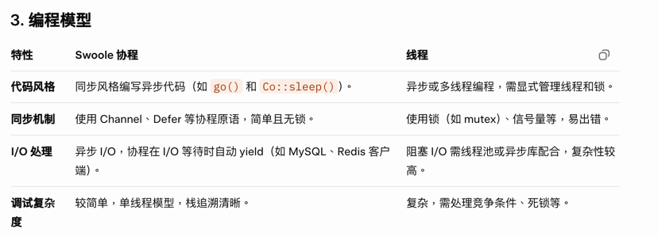
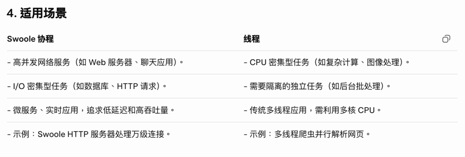

### swoole 协程与线程差异
* Swoole 协程与线程的交互
* Swoole 协程环境：Swoole 运行在单线程事件循环中，协程是用户态的“虚拟线程”，通过事件循环调度。PHP 的 Swoole 扩展通过 libeio 或 libuv 处理异步 I/O，协程在 I/O 等待
  
* 
* 
* 

### Swoole 的进程模型是什么？
* Master 进程：负责监听端口、管理 Worker/TaskWorker 生命周期。
* Manager 进程：负责管理 Worker/TaskWorker，异常退出时拉起新进程。
* Worker 进程：处理网络事件与业务逻辑（onReceive/onRequest 等）。
* TaskWorker 进程：异步任务处理（onTask/onFinish），避免阻塞 Worker。

### Worker 和 TaskWorker 的区别
* Worker：面向请求/连接，处理 IO 事件回调，尽量不做耗时操作。
* TaskWorker：专门跑耗时任务（发邮件、图片处理、调用第三方接口等）。
* 典型用法：Worker 收到请求后投递 task，快速返回；TaskWorker 异步完成。

### Swoole 协程是什么？适合哪些场景？
* 协程是用户态调度单位（比线程更轻量），遇到可挂起的 IO 会让出执行权。
* 适合：大量 IO 并发（HTTP/RPC/DB/Redis），减少线程/进程开销。
* 不适合：纯 CPU 密集计算（会占满事件循环，影响所有协程）。

### 协程和异步回调的区别
* 异步回调：需要写回调函数，流程割裂，易形成“回调地狱”。
* 协程：用同步写法写异步逻辑，可读性好；底层仍是事件驱动。

### Swoole 常见生命周期回调有哪些？
* onStart：Master 启动。
* onManagerStart：Manager 启动。
* onWorkerStart：Worker/TaskWorker 启动（适合做初始化）。
* onWorkerExit/onWorkerStop：进程退出/停止。
* TCP：onConnect/onReceive/onClose。
* HTTP：onRequest。
* Task：onTask/onFinish。

### 为什么 onWorkerStart 里要避免创建全局共享连接？
* 每个 Worker 是独立进程，进程间内存不共享。
* 连接（DB/Redis）应在每个 Worker 内各自创建并复用（连接池/长连接）。
* 如果在 Master 里创建连接，fork 后可能导致连接状态异常。

### Swoole 如何避免阻塞 Worker？
* 耗时逻辑放到 TaskWorker（task/finish）。
* 使用协程客户端（协程 MySQL/Redis/HTTP）让 IO 可挂起。
* 避免在 Worker 中执行：sleep、文件大 IO、CPU 密集计算、大循环。

### Swoole 定时器怎么用？有哪些注意点？
* 常见：swoole_timer_after / swoole_timer_tick。
* 注意：定时器回调运行在 Worker 内，同样不能做长时间阻塞。
* 需要考虑：重入（tick 未执行完又触发）、异常处理与取消定时器。

### Swoole 中如何实现进程间通信（IPC）？
* 进程间消息：sendMessage（Worker 间）、管道（Unix socket）、消息队列。
* 共享内存：Swoole\Table（适合小型共享状态，注意容量与并发写）。
* 通常更推荐：把共享状态放到 Redis/MySQL 等外部存储，减少进程间复杂度。

### Swoole\Table 适合做什么？
* 适合：计数器、在线人数、简单配置缓存、心跳/状态表。
* 不适合：存大对象/大文本、复杂结构（字段类型受限）。
* 注意：Table 是固定容量，创建时要估算行数与字段。

### Swoole 的热重载（reload）是怎么做的？
* reload 会平滑重启 Worker（Manager 逐个重启），连接尽量不受影响。
* 常用于：代码更新、配置更新。
* 注意：
* 必须确保业务状态可重建（避免依赖进程内状态）。
* onWorkerStart 做好初始化与资源重连。

### Swoole 内存泄漏如何排查？
* 常见原因：全局数组持续增长、缓存未清理、对象引用链、第三方扩展泄漏。
* 手段：
* 定期监控 Worker 内存（memory_get_usage）。
* 设置 max_request 自动重启 Worker，控制长期运行带来的碎片/泄漏。
* 结合 pmap/top、swoole 的 stats 信息定位。

### max_request 有什么用？为什么要设置？
* 每处理 N 个请求重启 Worker，降低内存碎片与潜在泄漏影响。
* 代价：重启期间会有轻微抖动；需要配合足够的 worker_num。

### worker_num 一般怎么设置？
* CPU 密集：接近 CPU 核数。
* IO 密集：可略高于 CPU 核数（但不要盲目开太多，避免上下文切换）。
* 需要结合：压测、CPU 使用率、RT、队列堆积情况。

### dispatch_mode 有哪些常见模式？
* 影响连接请求如何分配到 Worker。
* 常见目标：
* 尽量让同一连接固定到同一 Worker（便于连接上下文）。
* 或者更均匀分配，避免单 Worker 热点。
* 具体模式选择要结合协议（TCP/HTTP/WebSocket）与业务特性。

### WebSocket 场景常见面试点
* 如何保存 fd 与用户的映射：fd->uid/uid->fd（可用 Table/Redis）。
* 如何群发：遍历连接列表或维护房间/频道（注意性能与大连接数）。
* 断线重连：需要处理 fd 变化与旧连接清理。

### Swoole 常见坑有哪些？
* 在 Worker 中使用阻塞 IO 或长时间 CPU 计算导致整体卡顿。
* 把请求级变量存全局导致数据串扰（尤其在协程并发下）。
* 忽略异常处理导致协程泄漏/资源未释放。
* 在 onWorkerStart 初始化资源后，reload/重启时未正确重连。
